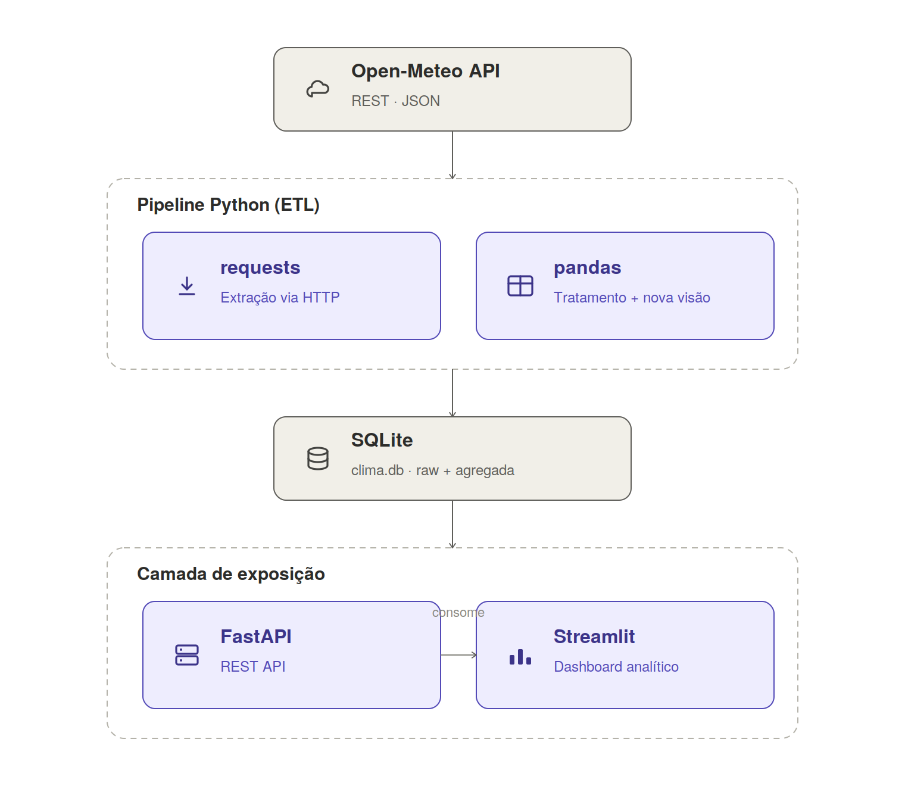

# Clima Pipeline

Pipeline de dados climáticos: Open-Meteo → tratamento (pandas) → agregações →
SQLite → REST API (FastAPI) → dashboard (Streamlit).

## Sobre o projeto

Este projeto nasceu como material didático para ensinar, de ponta a ponta, o
ciclo de vida de um dado — desde a extração de uma API pública até um
dashboard interativo — usando 5 cidades brasileiras (São Paulo, Rio de
Janeiro, Manaus, Porto Alegre e Recife) como estudo de caso, por reunirem
climas bem distintos entre si.

O aprendizado acontece em duas camadas complementares:

- **[notebooks/](notebooks/)** — partes introdutórias, passo a passo: extração
  via `requests`, tratamento e novas visões com `pandas`, exploração visual
  com `seaborn`/`matplotlib`, persistência com `sqlite3`/`SQLAlchemy` e boas
  práticas de Python (type hints, `try`/`except`, `logging`).
- **[src/clima_pipeline/](src/clima_pipeline/)** — a mesma lógica das aulas,
  reescrita como um pacote Python modular (POO, logging, tipagem), exposta
  por uma REST API e consumida por um dashboard — o formato que um pipeline
  desse tipo assumiria em produção.

### Fluxo de dados

```
Open-Meteo API  →  Extração  →  Tratamento (pandas)  →  Nova visão (agregações)
      →  SQLite (raw + tratada)  →  REST API (FastAPI)  →  Streamlit (dashboard)
```



## Estrutura

```
notebooks/            # partes introdutórias (exploração passo a passo)
├── 01_extracao_open_meteo.ipynb       # Parte 1 — ingestão via requests (Open-Meteo)
├── 02_tratamento_pandas.ipynb         # Parte 2 — tratamento e limpeza com pandas
├── 03_nova_visao_agregacoes.ipynb     # Parte 3 — agregações e features (groupby, resample...)
├── 04_exploracao_visual.ipynb         # Parte 3.2 — exploração visual (matplotlib/seaborn)
├── 05_sqlite_persistencia.ipynb       # Parte 4 — persistência com sqlite3 e SQLAlchemy
├── 06_boas_praticas_python.ipynb      # Parte 5 — type hints, try/except e logging
└── README.md                          # teoria de SQLite e SQLAlchemy usada na Parte 4
src/
├── README.md           # boas práticas de Python (PEP 8, docstrings, logging, debug)
└── clima_pipeline/
    ├── config.py          # cidades, caminhos, URLs, configuração via ambiente
    ├── extract/           # OpenMeteoClient — fala com a API
    ├── transform/         # ClimaCleaner (tratamento) e ClimaAggregator (visão diária)
    ├── load/               # SQLiteRepository — persistência (upsert)
    ├── pipeline.py         # ClimaPipeline — orquestra tudo, com CLI
    ├── api/                # FastAPI (main.py + schemas.py)
    ├── dashboard/          # Streamlit (app.py), consome a API — nunca o banco direto
    └── logging_config.py   # logging central (console + logs/pipeline.log)
data/
├── raw/                # JSON bruto por cidade
├── processed/          # CSVs intermediários gerados pelos notebooks
└── clima.db            # SQLite (tabelas clima_raw e clima_diario)
docs/                   # documentação Sphinx (referência de classes/funções + teoria)
├── README.md           # teoria do Sphinx e como buildar/estender
├── conf.py             # configuração do Sphinx
├── index.rst           # página inicial
├── api/                # um .rst por módulo, com autodoc
└── _build/html/        # HTML gerado (abrir index.html)
```

## Tutoriais: instalando e configurando Python + VSCode

Se este é seu primeiro contato com o ambiente, siga esta ordem antes do Setup abaixo:

1. **Instalar o Python**
   - Windows/macOS/Linux: [python.org/downloads](https://www.python.org/downloads/) (marque
     "Add Python to PATH" no instalador do Windows).
   - macOS (alternativa via [Homebrew](https://brew.sh/)): `brew install python`.
   - Linux (Debian/Ubuntu): `sudo apt install python3 python3-venv python3-pip`.
   - Confirme a instalação: `python3 --version` (ou `python --version` no Windows).
2. **Criar um ambiente virtual** (isola as dependências deste projeto do resto do sistema):
   ```bash
   python3 -m venv .venv
   source .venv/bin/activate       # Windows: .venv\Scripts\activate
   ```
   Guia oficial: [docs.python.org/3/library/venv](https://docs.python.org/3/library/venv.html).
3. **Instalar o VSCode**: [code.visualstudio.com](https://code.visualstudio.com/download).
4. **Instalar a extensão Python** (Microsoft) pelo Marketplace do VSCode — habilita
   IntelliSense, execução/debug de notebooks e scripts, e detecção automática do
   ambiente virtual criado no passo 2.
   - Extensão: [marketplace.visualstudio.com/items?itemName=ms-python.python](https://marketplace.visualstudio.com/items?itemName=ms-python.python)
   - Extensão Jupyter (para abrir os `.ipynb` de `notebooks/` direto no VSCode):
     [marketplace.visualstudio.com/items?itemName=ms-toolsai.jupyter](https://marketplace.visualstudio.com/items?itemName=ms-toolsai.jupyter)
5. **Selecionar o interpretador correto no VSCode**: `Ctrl+Shift+P` /
   `Cmd+Shift+P` → "Python: Select Interpreter" → escolha o `.venv` criado no passo 2.
6. **Tutoriais oficiais para se aprofundar**:
   - [Python for Beginners (Microsoft/VSCode)](https://code.visualstudio.com/docs/python/python-tutorial)
   - [Documentação oficial do Python (tutorial)](https://docs.python.org/3/tutorial/)
   - [Working with Jupyter Notebooks in VSCode](https://code.visualstudio.com/docs/datascience/jupyter-notebooks)
   - [Debugging Python in VSCode](https://code.visualstudio.com/docs/python/debugging)

Documentação complementar deste projeto:
[notebooks/README.md](notebooks/README.md) (teoria de SQLite/SQLAlchemy),
[src/README.md](src/README.md) (boas práticas de Python) e
[docs/README.md](docs/README.md) (documentação gerada com Sphinx).

## Setup

```bash
pip install -e .
cp .env.example .env  # opcional — todos os valores já têm um padrão
```

Para rodar o notebook de exploração visual
([04_exploracao_visual.ipynb](notebooks/04_exploracao_visual.ipynb), que usa
`seaborn`), instale o extra `notebooks`: `pip install -e ".[notebooks]"`.

## Rodando o pipeline

```bash
python -m clima_pipeline.pipeline
# ou, para um subconjunto de cidades e período:
python -m clima_pipeline.pipeline --cidades sao_paulo recife --inicio 2025-01-01 --fim 2025-01-31
```

Isso popula `data/raw/`, `data/clima.db` (tabelas `clima_raw` e `clima_diario`) e
grava logs em `logs/pipeline.log`.

## Rodando a API

```bash
uvicorn clima_pipeline.api.main:app --reload
```

Endpoints: `/health`, `/cidades`, `/clima/diario?cidade=...&inicio=...&fim=...`,
`/clima/comparativo?cidades=SP,RJ&variavel=temp_media`. Docs interativas em
`/docs`.

Acesse `localhost:8000/docs` para documentação Swagger

## Rodando o dashboard

```bash
streamlit run src/clima_pipeline/dashboard/app.py
```

Requer a API rodando (o dashboard consome os endpoints acima, nunca acessa
`clima.db` diretamente).

## Gerando a documentação (Sphinx)

```bash
pip install -e ".[docs]"
cd docs && make html
```

Sirva a pasta gerada por um servidor HTTP local e abra no navegador (abrir o
`index.html` direto como `file://` quebra o CSS e os links entre páginas,
pois o navegador bloqueia esses recursos por segurança):

```bash
python3 -m http.server 8001 --directory docs/_build/html & open http://localhost:8001
```

Detalhes em [docs/README.md](docs/README.md).
